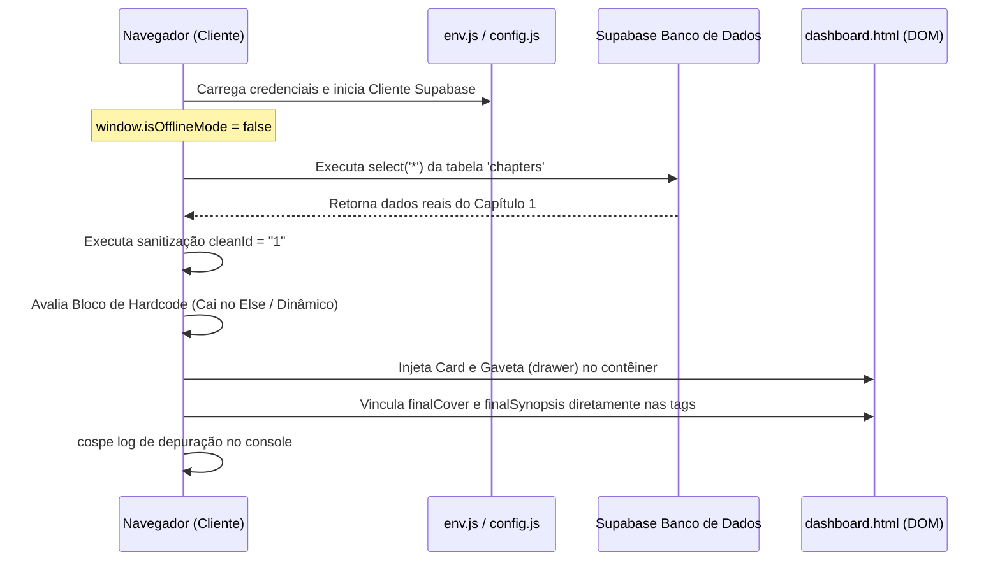

# Especificação Técnica e Fluxo Lógico: Capítulo 01 🧶🔌

Este documento detalha o mapeamento técnico completo, arquivos envolvidos, processamentos de rede e injeções de DOM referentes ao **Capítulo 01** no portal **Fio Vermelho** após a desativação da lógica estática local.

---

## 📁 1. Arquivos Envolvidos e Caminhos Relativos

*   **Configuração de Ambiente**: [env.js](file:///C:/Users/Barbara/Desktop/miles/site-fiovermelho/env.js)
    *   Armazena as chaves de conexão da API remota.
*   **Inicializador da API**: [js/supabase-config.js](file:///C:/Users/Barbara/Desktop/miles/site-fiovermelho/js/supabase-config.js)
    *   Estabelece a conexão e chaveia `window.isOfflineMode = false`.
*   **Engine de Renderização**: [js/dashboard.js](file:///C:/Users/Barbara/Desktop/miles/site-fiovermelho/js/dashboard.js)
    *   Executa a consulta remota e monta a interface visual de cards e gavetas.
*   **Interface Principal**: [dashboard.html](file:///C:/Users/Barbara/Desktop/miles/site-fiovermelho/dashboard.html)
    *   Contém a tag de destino (`#chapter-list-container`) onde o HTML do capítulo é inserido.
*   **Leitor Vertical**: [ler.html](file:///C:/Users/Barbara/Desktop/miles/site-fiovermelho/ler.html) & [js/ler.js](file:///C:/Users/Barbara/Desktop/miles/site-fiovermelho/js/ler.js)
    *   Processa as páginas contínuas do capítulo quando o usuário clica em "Ler Capítulo".

---

## ⚙️ 2. Sequência de Processamento Síncrono e Assíncrono



1.  **Carga do Documento**: O navegador lê os scripts na ordem: `env.js` -> `supabase-config.js` -> `dashboard.js`.
2.  **Handshake**: `supabase-config.js` valida as credenciais da API e desativa `window.isOfflineMode` (linha ~17).
3.  **Consulta Assíncrona (Fetch)**: `dashboard.js` chama `loadChaptersAndRenderGrid()` que executa o `select('*')` no banco de dados.
4.  **Loop e Sanitização**: O loop `.forEach` normaliza a chave `chap.id` para a string `"1"` (`cleanId`).
5.  **Bypass do Hardcode**: O condicional de segurança identifica que o ID não é `"2"`, caindo na cláusula `else`, lendo os metadados diretamente do objeto remoto (`chap.synopsis` e `chap.cover_url`).
6.  **Montagem DOM**: Renderiza o card do capítulo com a tag `` e a gaveta contendo `.chapter-drawer-cover img` e `.chapter-drawer-synopsis p`.
7.  **Atribuição Síncrona**: Seletores de DOM capturam as tags recém-injetadas e aplicam forçadamente os valores das variáveis `finalCover` e `finalSynopsis`.
8.  **Diagnóstico**: Cospe o agrupamento de logs `console.group("[DOM Render Diagnostic - Cap 1]")` detalhando o sucesso ou falha da resolução visual.

---

## 💻 3. Códigos e Linhas Relevantes (`js/dashboard.js`)

### A. A Consulta ao Banco de Dados (Linhas ~400)
```javascript
const { data, error } = await window.supabase
    .from('chapters')
    .select('*')
    .order('id', { ascending: true });
```
*   **O que faz**: Puxa o registro real cadastrado no Supabase correspondente ao Capítulo 1.

### B. O Bloco Condicional de Metadados (Linhas ~540)
```javascript
// --- INÍCIO DO HARDCODE DE SEGURANÇA BINDADO ---
let finalSynopsis = "";
let finalCover = "";

if (cleanId === "2" || parseInt(cleanId) === 2) {
    finalSynopsis = `Quando o seu pai te liga de madrugada, te chama pelo apelido de criança e pede para você levar um pudim e um estoque de desinfetante, você já sabe que o turno extra vai ser sujo. Sem a ajuda do guarda-costas oficial, o coroa intimou os pirralhos para assumirem o serviço doméstico de emergência. Mas quando o mais velho manda, os mais novos obedecem, por lealdade e, principalmente, amor.`;
    finalCover = "assets/capitulo_2.webp";
} else if (cleanId === "1" || parseInt(cleanId) === 1) {
    finalSynopsis = `O chefe dormiu de novo.
Agora cabe ao resto do grupo levá-lo para casa enquanto caminham pela cidade conversando sobre suas maiores preocupações: tacos de beisebol, gangues rivais, anime e o que vão fazer no próximo dia de folga.
Cochilos inesperados, amizades inabaláveis e uma normalidade completamente quebrada. São adoráveis, mas definitivamente não deveriam ser.`;
    finalCover = "assets/capitulo_2.webp";
} else {
    finalSynopsis = chap.synopsis || "Sinopse em breve.";
    finalCover = chap.cover_url || "assets/default_cover.webp";
}
// --- FIM DO HARDCODE DE SEGURANÇA BINDADO ---
```

### C. Mapeamento das Injeções do DOM (Linhas ~630)
```javascript
// Atribuição de Capa no Card principal
const elementoImg = chapterCard.querySelector(`#thumb-cap-${cleanId}`);
if (elementoImg) {
    elementoImg.src = finalCover;
}

// Atribuição de Capa na Gaveta (coluna de mídia interna)
const elementoImgDrawer = drawer.querySelector('.chapter-drawer-cover img');
if (elementoImgDrawer) {
    elementoImgDrawer.src = finalCover;
}

// Atribuição da Sinopse na Gaveta
const elementoText = drawer.querySelector('.chapter-drawer-synopsis p');
if (elementoText) {
    elementoText.textContent = finalSynopsis;
}
```

---

## 🛠️ 4. Guia de Manipulação para Desenvolvedores

*   **Para alterar a sinopse ou capa do Capítulo 1 na web**: 
    Não altere o código do front-end. Acesse o console do **Supabase**, navegue até a tabela `chapters`, localize a linha com `id = 1` e edite as colunas `synopsis` e `cover_url`. A página do leitor atualizará instantaneamente no próximo carregamento de forma síncrona.
*   **Para alterar os fallbacks do Capítulo 1 (caso venha nulo do banco)**: 
    Edite o bloco `else` no loop (linha ~551 do `js/dashboard.js`), substituindo `"Sinopse em breve."` ou `"assets/default_cover.webp"` pelos novos valores default.
