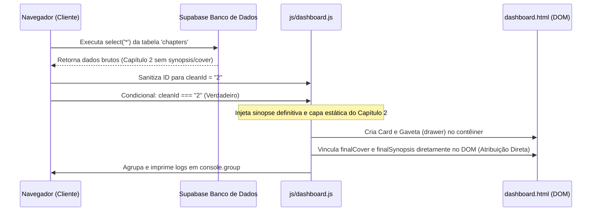

# Especificação Técnica e Fluxo Lógico: Capítulo 02 <table><tr><td>🧶🛡️</td></tr></table>

Este documento detalha o mapeamento técnico completo, caminhos envolvidos, processamentos de rede e injeções de DOM referentes ao **Capítulo 02** ("Cortes no Destino") no portal **Fio Vermelho**, operando sob a diretiva do Hardcode de Segurança.

---

## 📁 1. Arquivos Envolvidos e Caminhos Relativos

*   **Configuração de Ambiente**: [env.js](file:///C:/Users/Barbara/Desktop/miles/site-fiovermelho/env.js)
    *   Estabelece o escopo de autenticação do cliente.
*   **Inicializador da API**: [js/supabase-config.js](file:///C:/Users/Barbara/Desktop/miles/site-fiovermelho/js/supabase-config.js)
    *   Habilita a conexão em modo online (`window.isOfflineMode = false`).
*   **Engine de Renderização**: [js/dashboard.js](file:///C:/Users/Barbara/Desktop/miles/site-fiovermelho/js/dashboard.js)
    *   Processa a consulta e injeta o Hardcode de Segurança Isolado.
*   **Capa Oficial**: `assets/capitulo_2.webp`
    *   O asset gráfico local de capa do capítulo na pasta assets.
*   **Leitor Vertical**: [ler.html](file:///C:/Users/Barbara/Desktop/miles/site-fiovermelho/ler.html) & [js/ler.js](file:///C:/Users/Barbara/Desktop/miles/site-fiovermelho/js/ler.js)
    *   Processa as páginas contínuas do capítulo quando o usuário clica em "Ler Capítulo".

---

## ⚙️ 2. Sequência de Processamento Síncrono e Assíncrono



1.  **Carga do Documento**: O navegador lê os scripts na ordem padrão de deploy.
2.  **Handshake**: `supabase-config.js` estabelece a conexão ativa com o Supabase.
3.  **Consulta Assíncrona (Fetch)**: `dashboard.js` chama `loadChaptersAndRenderGrid()` que executa o `select('*')` no banco de dados.
4.  **Loop e Sanitização**: O loop `.forEach` normaliza a chave `chap.id` do banco para a string `"2"` (`cleanId`).
5.  **Gatilho do Hardcode de Segurança**: O condicional intercepta o ID e realiza o override síncrono completo:
    *   Ignora qualquer campo nulo ou vazio do Supabase.
    *   Define `finalSynopsis` com o texto oficial: *"Quando o seu pai te liga de madrugada..."*.
    *   Define `finalCover` apontando para o asset local `"assets/capitulo_2.webp?v=2"`.
6.  **Montagem DOM**: Renderiza o card do capítulo com a tag `` e a gaveta contendo `.chapter-drawer-cover img` e `.chapter-drawer-synopsis p`.
7.  **Atribuição Síncrona**: Seletores de DOM capturam as tags recém-injetadas e aplicam forçadamente os valores das variáveis `finalCover` e `finalSynopsis`.
8.  **Diagnóstico**: Cospe o agrupamento de logs `console.group("[DOM Render Diagnostic - Cap 2]")` detalhando o sucesso da resolução visual no console do desenvolvedor.

---

## 💻 3. Códigos e Linhas Relevantes (`js/dashboard.js`)

### A. O Bloco do Hardcode de Segurança (Linhas ~540)
```javascript
// --- INÍCIO DO HARDCODE DE SEGURANÇA BINDADO ---
let finalSynopsis = "";
let finalCover = "";

if (cleanId === "2" || parseInt(cleanId) === 2) {
    finalSynopsis = `Quando o seu pai te liga de madrugada, te chama pelo apelido de criança e pede para você levar um pudim e um estoque de desinfetante, você já sabe que o turno extra vai ser sujo. Sem a ajuda do guarda-costas oficial, o coroa intimou os pirralhos para assumirem o serviço doméstico de emergência. Mas quando o mais velho manda, os mais novos obedecem, por lealdade e, principalmente, amor.`;
    finalCover = "assets/capitulo_2.webp?v=2";
} else {
    finalSynopsis = chap.synopsis || "Sinopse em breve.";
    finalCover = chap.cover_url || "assets/default_cover.webp";
}
// --- FIM DO HARDCODE DE SEGURANÇA BINDADO ---
```

### B. Mapeamento das Injeções do DOM (Linhas ~630)
```javascript
// Atribuição de Capa no Card principal
const elementoImg = chapterCard.querySelector(`#thumb-cap-${cleanId}`);
if (elementoImg) {
    elementoImg.src = finalCover;
}

// Atribuição de Capa na Gaveta (coluna de mídia interna)
const elementoImgDrawer = drawer.querySelector('.chapter-drawer-cover img');
if (elementoImgDrawer) {
    elementoImgDrawer.src = finalCover;
}

// Atribuição da Sinopse na Gaveta
const elementoText = drawer.querySelector('.chapter-drawer-synopsis p');
if (elementoText) {
    elementoText.textContent = finalSynopsis;
}
```

---

## 🛠️ 4. Guia de Manipulação para Desenvolvedores

*   **Para alterar a sinopse ou capa do Capítulo 2 na web**: 
    Como o Capítulo 2 está blindado por Hardcode, alterações feitas no painel do Supabase serão ignoradas para este capítulo específico. Para modificar o texto ou a imagem, edite diretamente o arquivo [js/dashboard.js](file:///C:/Users/Barbara/Desktop/miles/site-fiovermelho/js/dashboard.js) nas linhas indicadas na Seção 3.A.
*   **Para remover a blindagem do Capítulo 2 no futuro**:
    Caso a tabela `chapters` do banco de dados seja atualizada para conter as colunas de metadados, você pode remover a condicional do Capítulo 2 do loop de modo que ele caia no bloco `else` e seja carregado 100% via Supabase, assim como o Capítulo 1.
