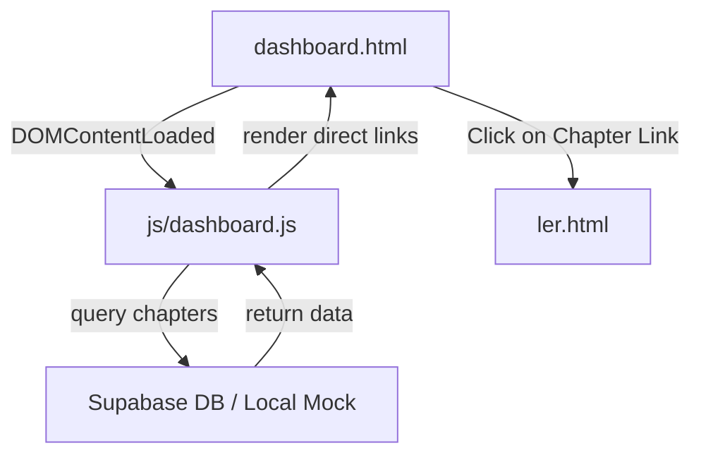

# Especificações Técnicas dos Capítulos (01 a 04) 🧶📖

Este documento reúne todas as especificações técnicas, rotas, lógica de carregamento, estilização e injeções de DOM do portal **Fio Vermelho** referentes aos capítulos disponíveis para leitura.

---

## 📁 1. Arquivos Envolvidos e Caminhos Relativos

*   **Configurações e Inicializadores**:
    *   [env.js](file:///c:/Users/Barbara/Desktop/miles/site-fiovermelho/env.js) (Chaves de API)
    *   [js/supabase-config.js](file:///c:/Users/Barbara/Desktop/miles/site-fiovermelho/js/supabase-config.js) (Inicialização do cliente Supabase e alternância de `window.isOfflineMode`)
*   **Listagem e Fluxos do Dashboard**:
    *   [dashboard.html](file:///c:/Users/Barbara/Desktop/miles/site-fiovermelho/dashboard.html) (Grid container `#chapter-list-container`)
    *   [js/dashboard.js](file:///c:/Users/Barbara/Desktop/miles/site-fiovermelho/js/dashboard.js) (Injeção dinâmica da lista de capítulos, títulos e descrições customizadas)
*   **Interface do Leitor Webtoon**:
    *   [ler.html](file:///c:/Users/Barbara/Desktop/miles/site-fiovermelho/ler.html) (Contêiner vertical contínuo `#webtoon-pages-container`)
    *   [js/ler.js](file:///c:/Users/Barbara/Desktop/miles/site-fiovermelho/js/ler.js) (Carregamento das imagens WebP, gestos de Double-Tap Zoom e restabelecimento de scroll)

---

## ⚙️ 2. Lógica da Listagem de Capítulos (Links Diretos)

A exibição de capítulos no Dashboard não utiliza gavetas colapsáveis ou elementos expansivos, simplificando a navegação com links diretos de redirecionamento:



### Injeção de Elementos âncora `<a>`
Para cada capítulo, o script `js/dashboard.js` gera um elemento link direto no formato:
```html
<a class="chapter-list-item" href="ler.html?cap=ID_DO_CAPITULO">
    <div style="display: flex; flex-direction: column; align-items: flex-start; flex: 1;">
        <span class="chapter-number">Capítulo ID</span>
        <span class="chapter-title">Título do Capítulo</span>
        <!-- Descrição Customizada em Branco (se aplicável) -->
    </div>
</a>
```

### Indicador Visual de Navegação (Chevron)
O lado direito de cada item possui um ícone de seta (`chevron-right`) para sinalizar que o clique abrirá uma nova página. Este comportamento é controlado via CSS em [css/style.css](file:///c:/Users/Barbara/Desktop/miles/site-fiovermelho/css/style.css):
```css
.chapter-list-item::after {
    content: "\f054"; /* FontAwesome Right Chevron */
    font-family: "Font Awesome 6 Free";
    font-weight: 900;
    color: var(--text-muted);
    font-size: 0.9rem;
    transition: all 0.3s ease;
}
.chapter-list-item:hover::after {
    color: var(--primary-red);
    transform: translateX(4px);
}
```

---

## 📝 3. Sinopses e Customizações dos Capítulos (1 ao 4)

Para assegurar uma identidade rica no Dashboard, as sinopses e títulos para os primeiros 4 capítulos possuem as seguintes definições (renderizadas em branco `#ffffff` para forte contraste contra o fundo escuro):

### Capítulo 1: Fim de Turno
*   **Título Exibido**: `Fim de Turno` (Sobregravação do título original se necessário).
*   **Descrição**:
    > *O chefe dormiu de novo. Agora cabe ao resto do grupo levá-lo para casa enquanto caminham pela cidade conversando sobre suas maiores preocupações: tacos de beisebol, gangues rivals, anime e o que vão fazer no próximo dia de folga. Cochilos inesperados, amizades inabaláveis e uma normalidade completamente quebrada. São adoráveis, mas definitivamente não deveriam ser.*

### Capítulo 2: Cortes no Destino
*   **Título Exibido**: `Cortes no Destino`
*   **Descrição**:
    > *Quando o seu pai te liga de madrugada, te chama pelo apelido de criança e pede para você levar um pudim e um estoque de desinfetante, você já sabe que o turno extra vai ser sujo. Sem a ajuda do guarda-costas oficial, o coroa intimou os pirralhos para assumirem o serviço doméstico de emergência. Mas quando o mais velho manda, os mais novos obedecem, por lealdade e, principalmente, amor.*

### Capítulo 3: O Laço Carmim
*   **Título Exibido**: `O Laço Carmim`
*   **Descrição**:
    > *O que um pirulito de cereja, um cosplay de Sailor Moon, Maximum The Hormone no talo, um pudim, velhos tarados e marmanjos enciumados têm em comum? Absolutamente nada, a menos que você faça parte dessa família e o patriarca resolva estragar a sua madrugada. Para o trio principal, o turno extra começou e a estrada vai ser longa, barulhenta e completamente disfuncional.*

### Capítulo 4
*   **Título Exibido**: Definido no Banco
*   **Descrição**:
    > *Neste capítulo: Os seios da novata, aparentemente, são domínio público. Fotos de bebês japoneses fofos em fraldas. Informações aleatórias sobre o cérebro de golfinhos. O chefe dormiu antes de todo mundo, de novo... e corpos cansados estão largados pelo chão de um apartamento pequeno demais em cima de um velho Ramen-ya*

---

## ⚡ 4. Mecânica de Leitura Contínua e Lupa (Double-Tap)

Ao entrar em `ler.html?cap=ID`, o leitor exibe as páginas da HQ de forma vertical contínua. As mecânicas críticas de UX implementadas são:

1.  **Foco Inicial Absoluto**: O script limpa o DOM e força o `window.scrollTo(0, 0)` para que o usuário inicie a leitura a partir da primeira linha física do capítulo.
2.  **Duplo Toque (Double-Tap) para Zoom Localizado**:
    *   Toques rápidos no espaço inferior a `300ms` ativam a classe `.is-zoomed` na imagem.
    *   O ponto de toque (`event.clientX`, `event.clientY`) é utilizado para calcular e atribuir dinamicamente a propriedade `transform-origin`, assegurando que a imagem amplie na proporção de **$1.8\times$** a partir do ponto clicado.
3.  **Memória de Scroll e Zoom-Out**:
    *   No momento do Zoom-In, a posição vertical do scroll da página (`window.scrollY`) é salva em memória.
    *   Ao efetuar um clique simples (Zoom-Out), o zoom é desativado e o navegador força a restauração imediata do scroll para a exata posição capturada anteriormente, evitando qualquer desalinhamento ou "salto" de leitura.
4.  **Anti-Cópia e Proteção de Conteúdo**:
    *   O clique direito (contextmenu), ações de arrastar (drag) e atalhos de desenvolvedor (F12, Ctrl+Shift+I, etc.) são bloqueados para usuários comuns, garantindo a integridade intelectual das ilustrações.
