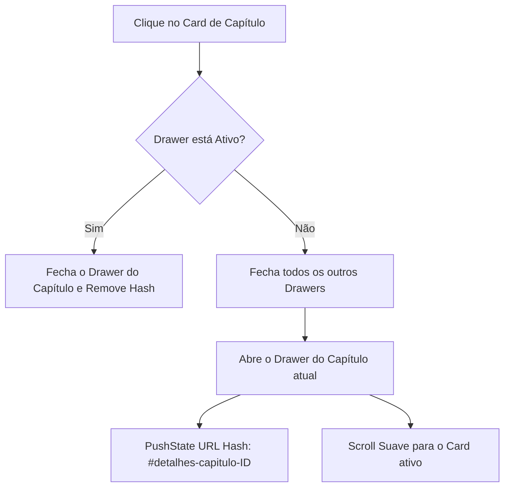

# Guia de Transição Técnica e Documentação: Portal Fio Vermelho 🧶🛡️

Este documento reúne todas as especificações técnicas, decisões de design, fluxos lógicos e infraestrutura da plataforma **Fio Vermelho** desde o início das nossas implementações. Ele serve como o guia definitivo de engenharia para que novos desenvolvedores compreendam a arquitetura e saibam exatamente onde e como dar manutenção na programação.

---

## 📖 1. Visão Geral do Projeto

O **Fio Vermelho** é um portal web interativo para leitura de quadrinhos digitais (estilo Webtoon vertical) focado em um público maior de idade. Possui uma estética *Noir/Yakuza*, utilizando tonalidades escuras profundas, efeitos de vidro (glassmorphism) e neon vermelho pulsante.

O sistema integra-se ao **Supabase** para gerenciamento de banco de dados (perfis, capítulos, leads) e armazenamento de arquivos (páginas dos quadrinhos no Storage), oferecendo um fluxo de verificação de maioridade integrado a um gateway simulado/real de pagamentos via PIX.

---

## 📁 2. Estrutura de Arquivos e Componentes

```bash
site-fiovermelho/
├── index.html                # Tela de Entrada / Login / Registro
├── dashboard.html            # Grid de Capítulos / Gaveta de Detalhes
├── ler.html                  # Leitor Vertical Contínuo de Webtoon
├── admin.html                # Painel de Administração do Autor
├── css/
│   └── style.css             # Folha de Estilos Global (Design Noir)
├── js/
│   ├── auth.js               # Gerenciador de Sessão e Auth (Supabase/Mock)
│   ├── dashboard.js          # Controle do Grid, Accordion e Hardcodes
│   ├── ler.js                # Lógica do Leitor, Otimização e Scroll
│   ├── admin.js              # Controle de Envio de Páginas e Capítulos
│   └── supabase-config.js    # Inicialização da API Cliente do Supabase
├── assets/                   # Imagens, Capas e Configurações Locais
│   ├── capitulo_1.webp
│   ├── capitulo_2.webp
│   └── config.json           # Definições estáticas adicionais
├── scripts/
│   └── build-env.js          # Script NodeJS para geração de variáveis no Build
└── api/                      # Endpoints Serverless (Mercado Pago / Pix)
```

---

## 🔒 3. Proteção de Rotas, Maioridade e Integração PIX

O projeto opera sob rígidas validações de acesso para conformidade legal (ECA) e monetização:

### A. Proteção de Rota Síncrona (`head`)
No topo do `<head>` de `dashboard.html`, `ler.html` e `admin.html`, roda um script inline síncrono que verifica a existência de sessão ativa. Se ausente, o usuário é redirecionado instantaneamente para `index.html` antes da renderização do DOM (evitando piscadas de tela).

### B. Whitelist Administrativa
Apenas e-mails específicos possuem acesso à tela `admin.html`:
```javascript
const adminWhitelist = ["miles.kensuke@gmail.com", "omoloyaartes@gmail.com"];
```
Caso outro e-mail autenticado tente acessar a página, o script bloqueia o carregamento e força o redirecionamento para `dashboard.html`.

### C. Bloqueio de Maioridade (ECA) & Polling do PIX
1. Usuários recém-registrados caem sob o status `pendente_verificacao`.
2. Um modal bloqueador absoluto (`#dashboard-lock-overlay`) cobre toda a tela do leitor e impede interações e rolagem do `body`.
3. É iniciado um **Polling periódico seguro a cada 4 segundos** que consulta a tabela `profiles` no Supabase (coluna `status`).
4. Quando o pagamento do PIX de verificação é processado no backend, o status altera para `'pago'` (ou `'approved'`), o intervalo é limpo imediatamente (`clearInterval`), o modal é ocultado e a listagem de capítulos é renderizada.
5. Há também um botão manual ("Verificar Pix") para forçar a checagem instantânea de forma síncrona.

---

## ⚡ 4. Lógica do Grid de Capítulos e Gaveta Netflix (`dashboard.html`)

O dashboard exibe os capítulos disponíveis em um grid elegante. Em vez de pop-ups ou modais intrusivos, utiliza-se um sistema de gaveta deslizante integrado ao fluxo da página.



### A. Mecânica do Accordion Integrado (`.chapter-drawer`)
*   Os contêineres de gaveta são criados dinamicamente logo após o card de cada capítulo no DOM.
*   Quando ativado, o drawer recebe a classe `.active`, expandindo de `max-height: 0` para `max-height: 600px` de forma extremamente fluida (através de transições bezier).
*   **Comportamento in-flow**: A gaveta empurra os cards subsequentes para baixo nativamente, sem usar posicionamentos absolutos ou travas de tela.

### B. Integração com o Histórico de Navegação (Mobile Back-Button Shield)
Para evitar que o usuário saia da página ao tentar fechar a gaveta usando o botão de voltar físico/gestual do celular:
1. Ao abrir o drawer, é injetado um estado no histórico do navegador:
   ```javascript
   history.pushState({ drawerOpen: true, chapterId: chapterId }, '', `#detalhes-capitulo-${chapterId}`);
   ```
2. Um ouvinte de evento `popstate` captura a ação de retorno do usuário e recolhe todas as gavetas ativas de forma limpa, mantendo-o no dashboard.

---

## 🚨 5. Hardcode de Segurança Absoluto no Loop do Dashboard

Devido à ausência das colunas de `synopsis` e `cover_url` na estrutura do banco de dados remoto Supabase, a leitura online resultava na herança indevida das informações do Capítulo 1 sobre os outros capítulos. Para mitigar isso em nível sênior, implementamos um **Hardcode de Segurança Isolado e Bindado** dentro do renderizador.

### A. Condicional Isolada
No arquivo [js/dashboard.js](file:///C:/Users/Barbara/Desktop/miles/site-fiovermelho/js/dashboard.js), a definição de dados no loop de renderização obedece à risca a seguinte estrutura:

```javascript
// --- INÍCIO DO HARDCODE DE SEGURANÇA BINDADO ---
let finalSynopsis = "";
let finalCover = "";

if (String(chap.id).trim() === "2") {
    finalSynopsis = `Quando o seu pai te liga de madrugada, te chama pelo apelido de criança e pede para você levar um pudim e um estoque de desinfetante, você já sabe que o turno extra vai ser sujo. Sem a ajuda do guarda-costas oficial, o coroa intimou os pirralhos para assumirem o serviço doméstico de emergência. Mas quando o mais velho manda, os mais novos obedecem, por lealdade e, principalmente, amor.`;
    finalCover = "assets/capitulo_2.webp?v=2";
} else {
    finalSynopsis = chap.synopsis || "Sinopse em breve.";
    finalCover = chap.cover_url || "assets/default_cover.webp";
}
// --- FIM DO HARDCODE DE SEGURANÇA BINDADO ---
```

### B. Vinculação Sólida no DOM (Atribuição Direta e Sanitização)
Para evitar conflitos de tipos (String vs Number) ou espaços indevidos vindos do Supabase, o ID é sanitizado usando `const cleanId = String(chap.id).trim()`. Em seguida, os elementos visuais são injetados de forma síncrona e explícita no DOM, garantindo que o acoplamento ocorra sem latências:

```javascript
// Onde a imagem da capa do capítulo é definida
const elementoImg = chapterCard.querySelector(`#thumb-cap-${cleanId}`);
if (elementoImg) {
    elementoImg.src = finalCover;
}

// Onde a capa do capítulo na gaveta é definida
const elementoImgDrawer = drawer.querySelector('.chapter-drawer-cover img');
if (elementoImgDrawer) {
    elementoImgDrawer.src = finalCover;
}

// Onde o texto da sinopse da gaveta é injetado
const elementoText = drawer.querySelector('.chapter-drawer-synopsis p');
if (elementoText) {
    elementoText.textContent = finalSynopsis;
}
```

### C. Logs de Diagnóstico Temporários
Adicionamos uma estrutura de agrupamento de logs no console (`console.group`) a cada renderização para depuração rápida de DOM e carregamento de CSS (como checagem de `.active` com `max-height` colapsado):
```javascript
console.group(`[DOM Render Diagnostic - Cap ${cleanId}]`);
console.log("ID original do banco:", chap.id, " | ID sanitizado (cleanId):", cleanId);
console.log("Variável finalCover vinculada:", finalCover);
console.log("Seletor imagem do card (#thumb-cap-...):", elementoImg ? "OK" : "NULO");
console.log("Seletor imagem da gaveta (.chapter-drawer-cover img):", elementoImgDrawer ? "OK" : "NULO");
console.log("Seletor texto da sinopse (.chapter-drawer-synopsis p):", elementoText ? "OK" : "NULO");
console.groupEnd();

console.log(`[DOM Render] Cap: ${chap.id} | Capa aplicada: ${finalCover} | Texto aplicado: ${finalSynopsis.substring(0, 20)}...`);
```

### D. Proteção contra Loops de Erro na Imagem
O atributo `onerror` das imagens do card foi alterado de fallbacks móveis genéricos para apontar exclusivamente para `assets/default_cover.webp`, impedindo vazamento de dados visuais do Capítulo 1:
```html
onerror="this.onerror=null; this.src='assets/default_cover.webp';"
```

---

## 📖 6. Otimização Arquitetural do Leitor Webtoon (`ler.html`)

O leitor vertical contínuo foi otimizado para lidar com conexões lentas e telas móveis:

### A. Inversão do Ciclo de Carregamento (Race Condition Fix)
*   **Problema**: O código antigo iniciava `img.src` antes de registrar o evento `img.onload`. Em imagens pré-carregadas pelo navegador (cache), o trigger disparava instantaneamente e o ouvinte subsequente era ignorado, deixando a HQ invisível (opacidade zerada).
*   **Solução**: Invertemos a ordem de inicialização. Os manipuladores de evento são atrelados primeiro, seguidos da atribuição do `src`. Um teste defensivo final em `img.complete` cobre qualquer execução síncrona.

### B. Scroll-to-Top Coordinative Fallback
Devido à inserção assíncrona de páginas no DOM, o navegador sofria com cálculos imprecisos de altura do contêiner. Resolvido aplicando:
1. Limpeza profunda do wrapper (`pageWrapper.innerHTML = '';`) na carga bem-sucedida, deixando apenas o nó nativo ``.
2. Atraso síncrono de `150ms` exclusivo para a primeira página (`i === 1`) para disparar a rolagem vertical síncrona tripla:
   ```javascript
   window.scrollTo(0, 0);
   document.documentElement.scrollTop = 0;
   document.body.scrollTop = 0;
   ```

### C. Destravamento e Performance Mobile (Scroll & Touch)
*   Eliminação de qualquer restrição de altura (`height: 100%` ou `overflow: hidden`) nos wrappers principais, devolvendo o controle da rolagem física vertical à janela principal (`window`).
*   Diretiva `touch-action: pan-y !important;` aplicada via CSS nas classes `.webtoon-canvas` e `.webtoon-page-img` para que gestos na tela do celular não ativem o menu nativo de cópia/seleção de imagem, garantindo scroll contínuo e fluidez inercial.

---

## 🛠️ 7. Algoritmo Client-Side de Compressão Canvas WebP

Na área de administração, todas as imagens sofrem uma pré-otimização via motor Canvas antes do upload ou gravação em banco:

1.  **Limitação Proporcional**:
    *   Imagens de capa horizontais: largura máxima truncada em **1920px**.
    *   Páginas verticais de HQ: largura máxima truncada em **1080px**.
    *   A altura é reajustada mantendo a proporção de aspecto (aspect ratio).
2.  **Qualidade Controlada**:
    *   Exportação de blob WebP com qualidade ajustada em exatos **`0.75`** (75% de compressão).
3.  **Cálculo de Economia**:
    *   Imprime as estatísticas de redução no console para acompanhamento e auditoria de banda do storage do Supabase.

---

## 🗄️ 8. Modo Dual de Persistência (Online vs. Offline)

O portal é dotado de uma chave de alternância rápida `window.isOfflineMode` (configurada em [js/supabase-config.js](file:///C:/Users/Barbara/Desktop/miles/site-fiovermelho/js/supabase-config.js)), útil para testes sem conexão ou deploys de demonstração:

| Recurso | Modo Online (Supabase Ativo) | Modo Offline (Local Fallback) |
| :--- | :--- | :--- |
| **Autenticação** | Supabase Auth (`supabase.auth`) | Lista de usuários locais mockados no `LocalStorage` |
| **Capítulos** | Consulta síncrona na tabela `chapters` | Definição local unificada no array `defaultChapters` |
| **Páginas (HQ)** | Armazenadas no Bucket público `paginas-quadrinho` | Session-scoped Object URLs temporárias |
| **Leads** | Inserção direta na tabela `leads` | Array de e-mails em formato JSON no `LocalStorage` |

---

## 🧭 9. Guia de Manutenção e Evolução Técnica (Como Alterar o Código)

### A. Para alterar o texto/capa do Capítulo 1 ou 2
Vá diretamente para o bloco do Hardcode em [js/dashboard.js](file:///C:/Users/Barbara/Desktop/miles/site-fiovermelho/js/dashboard.js) (Linhas ~540) e modifique as strings associadas a `finalSynopsis` ou `finalCover` correspondentes ao ID desejado.

### B. Para adicionar novos capítulos na lista local (Offline)
No mesmo arquivo [js/dashboard.js](file:///C:/Users/Barbara/Desktop/miles/site-fiovermelho/js/dashboard.js), atualize o array estático `defaultChapters` localizado próximo à linha 350.

### C. Para atualizar a chave de produção do Supabase
Modifique as chaves correspondentes no arquivo de deploy ou altere diretamente no arquivo local [env.js](file:///C:/Users/Barbara/Desktop/miles/site-fiovermelho/env.js) (gerado automaticamente em produção a partir do script [scripts/build-env.js](file:///C:/Users/Barbara/Desktop/miles/site-fiovermelho/scripts/build-env.js)).
