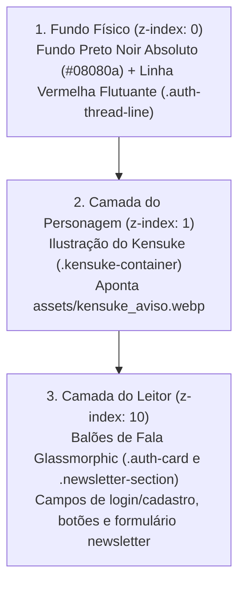

# 🧶 Especificações Técnicas e Visuais: Página de Abertura (Bloqueio ECA)

Este guia documenta detalhadamente a arquitetura visual, os componentes de estilo e a lógica de camadas da **Página de Abertura / Verificação de Maioridade (ECA)** do site Fio Vermelho. Foi projetado para que designers gráficos, ilustradores e desenvolvedores front-end compreendam exatamente como o layout está programado e como as artes se integram à interface.

---

## 🎨 1. Diretrizes de Design & Paleta de Cores (CSS Variables)

O layout utiliza uma estética **Noir Premium com acentos Carmim (Glow)**, combinando transparência vítrea com contraste escuro profundo. Todas as cores e transições estão centralizadas no design system do arquivo [style.css](file:///c:/Users/Barbara/Desktop/miles/site-fiovermelho/css/style.css):

| Token CSS | Cor / Valor | Aplicação Visual |
| :--- | :--- | :--- |
| `--bg-primary` | `#08080a` (Preto Noir Absoluto) | Fundo geral da página |
| `--primary-red` | `#ff2a3b` (Vermelho Carmim Vivo) | Botões principais, links ativos e destaques |
| `--primary-red-hover`| `#e01b2c` (Vermelho Carmim Escuro) | Feedback visual ao passar o mouse (Hover) |
| `--primary-red-glow` | `rgba(255, 42, 59, 0.35)` | Efeito de brilho neon (box-shadow/drop-shadow) |
| `--bg-glass` | `rgba(13, 13, 17, 0.75)` (Cinza Grafite Fumê) | Fundo semi-transparente das caixas (balões) |
| `--border-glass` | `rgba(255, 255, 255, 0.05)` | Borda extremamente fina e sutil dos cards |
| `--glass-blur` | `blur(20px)` | Efeito de vidro jateado (backdrop-filter) |
| `--text-primary` | `#ffffff` | Títulos e textos de alta importância |
| `--text-secondary` | `#a3a3ac` | Descrições, parágrafos e rótulos de campos |
| `--text-muted` | `#6b6b76` | Placeholders, ícones inativos e textos de rodapé |

---

## 🧱 2. Arquitetura de Camadas (Depth & Z-Index Hierarchy)

A tela de abertura é montada como um cenário tridimensional sanduichado, onde a ilustração do personagem fica posicionada fisicamente no meio de duas camadas visuais. Isso permite que a arte interaja diretamente com as caixas de texto.



### Detalhamento das Camadas:

1.  **Camada 1: Background (`z-index: 0` ou fluxo normal)**
    *   **Fundo:** `#08080a`
    *   **Fio Vermelho Decorativo (`.auth-thread-line`):** Uma linha vermelha translúcida fina rotacionada a `-15deg` com uma animação infinita de flutuação suave (`threadFloat`) que cruza a tela por trás do personagem.
2.  **Camada 2: Midground / Personagem (`z-index: 1` absoluto)**
    *   **Contêiner (`.kensuke-container`):** Centralizado horizontal e verticalmente na tela através de `position: absolute; top: 50%; left: 50%; transform: translate(-50%, -50%);`.
    *   **Comportamento de Clique (`pointer-events: none`):** Garante que a ilustração seja completamente "invisível" para cliques do mouse. Se o usuário clicar em cima da imagem do Kensuke, o clique atravessa a imagem e atua diretamente nos campos ou botões que estão por trás ou na frente.
    *   **Filtros de Quadrinho (`filter`):** Aplica sombras projetadas escuras (`drop-shadow`), contraste de quadrinho elevado (`contrast(1.1)`) e redução de brilho (`brightness(0.7)`) para integrar o personagem ao tema Noir.
    *   **Efeito Degradê (`mask-image`):** Uma máscara gradiente aplicada via CSS faz com que a base do corpo do Kensuke suma de forma suave em direção ao rodapé, misturando-se gradativamente ao fundo preto absoluto.
3.  **Camada 3: Foreground / Elementos de Interação (`z-index: 10` relativo)**
    *   Contém a caixa principal (`.auth-card`) e a newsletter (`.newsletter-section`). São as caixas que flutuam na frente do corpo do personagem.

---

## 💬 3. Balões de Fala Dinâmicos (CSS Comic Bubbles)

Tanto a caixa de aviso legal (`.auth-card`) quanto a newsletter (`.newsletter-section`) são programadas para funcionar visualmente como **balões de fala de quadrinhos (manga speech bubbles)**.

```
       [ Boca do Kensuke ]
             /        \
            /          \
   (Rabicho/Tail)     (Rabicho/Tail)
          /              \
    .auth-card       .newsletter-section
  [Balão de Fala 1]    [Balão de Fala 2]
```

### Especificações Técnicas dos Balões:
*   **Design Glassmorphism:** Ambos utilizam `background: rgba(13, 13, 17, 0.75)` com desfoque de fundo (`backdrop-filter: blur(20px)`), gerando o efeito clássico de vidro fumê jateado.
*   **Rabicho do Balão 1 (`.auth-card::after`):**
    *   **Posicionamento:** Canto superior direito do card (`top: -12px; right: 80px;`).
    *   **Construção Geométrica:** Um quadrado perfeito (`width: 24px; height: 24px;`) rotacionado a **`45deg`** (`transform: rotate(45deg)`). Isso faz com que a ponta superior aponte exatamente para cima, em direção à boca do Kensuke.
    *   **Borda Carmim:** Possui bordas iluminadas apenas nos lados esquerdo e superior (`border-left` e `border-top`) com a cor **Carmim** (`rgba(139, 0, 0, 0.45)`) e sombreamento suave.
    *   **Mesclagem Perfeita:** Como o rabicho herda as mesmas variáveis de desfoque e transparência da caixa mãe, ele se mescla e gera um desfoque contínuo, parecendo uma peça única de vidro moldado.
*   **Rabicho do Balão 2 (`.newsletter-section::after`):**
    *   **Posicionamento:** Canto superior esquerdo do card (`top: -12px; left: 80px;`).
    *   **Construção Geométrica:** Idêntico ao Balão 1, porém deslocado para a esquerda para indicar que é uma fala contínua do Kensuke direcionada ao leitor no rodapé.

---

## 📱 4. Responsividade Adaptativa (Mobile Design)

Para garantir que a arte não atrapalhe a leitura em telas de smartphones ou tablets de diferentes tamanhos, o comportamento responsivo foi rigorosamente programado via media queries (`@media (max-width: 768px)`):

*   **Redução da Arte:** A largura máxima da ilustração (`.kensuke-container`) é reduzida de **`480px`** para **`360px`** em aparelhos celulares, fazendo o Kensuke encolher proporcionalmente.
*   **Opacidade Suave:** A opacidade da arte (`.kensuke-img`) diminui de `0.65` para **`0.45`**. Isso faz com que Kensuke atue como uma marca d'água estilizada de fundo, garantindo contraste absoluto de 100% para a leitura dos textos e cliques de digitação.
*   **Ajuste de Rabichos:** Os rabichos dos balões são deslocados ligeiramente para as bordas (`right: 40px` e `left: 40px` respectivamente) para se manterem visualmente alinhados com o encolhimento do personagem.

---

## 📝 5. Como entregar essas especificações para o seu Designer:

> [!NOTE]
> **Dicas para o designer ao produzir novas variações da arte (`kensuke_aviso.webp`):**
> 1. **Proporções de Exportação:** Recomenda-se exportar a imagem do Kensuke em formato transparente (`.webp` ou `.png` de alta qualidade) com dimensões quadradas ou verticais (ex: `800x1000px`).
> 2. **Posição da Cabeça/Boca:** A cabeça do personagem deve ficar centralizada na parte superior da imagem, pois os rabichos dos balões estão programados para apontar para a parte superior central da tela (coordenada `top: -12px` de caixas com largura de `480px`).
> 3. **Base do Personagem:** A cintura ou base do tronco do personagem deve terminar em fade-out ou ser limpa, pois o CSS aplica a máscara de transparência na base para fundi-lo ao noir do site.
